# Developers.google exercises:

*Task 1: The model as given combines our two input features into a single neuron. Will this model learn any nonlinearities? Run it to confirm your guess.*

No.

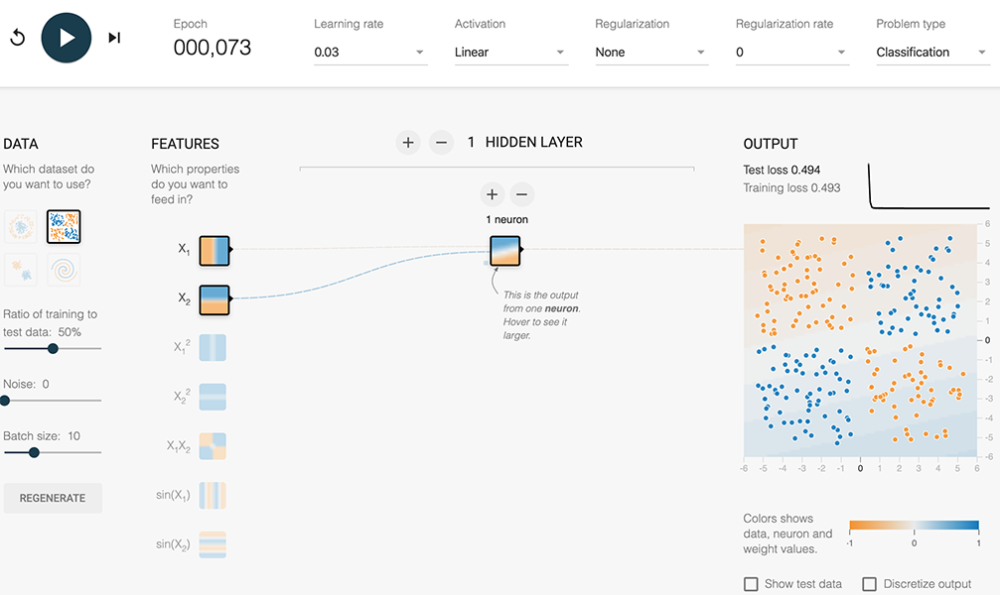
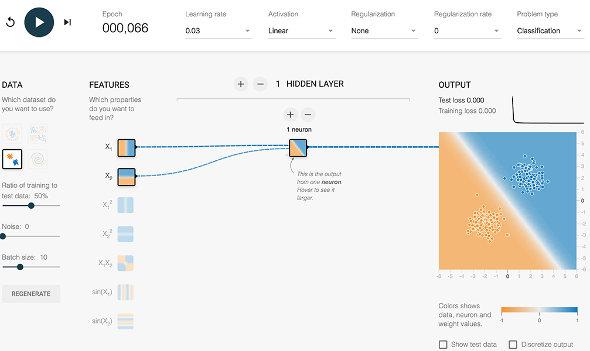
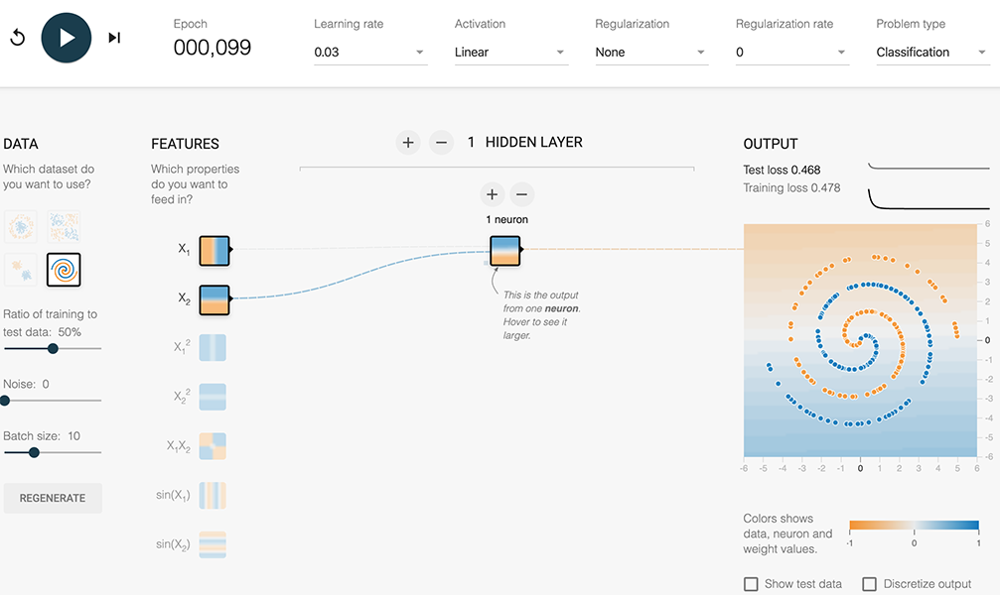

*Task 2: Try increasing the number of neurons in the hidden layer from 1 to 2, and also try changing from a Linear activation to a nonlinear activation like ReLU. Can you create a model that can learn nonlinearities? Can it model the data effectively?*

It does a slightly better job but not really.

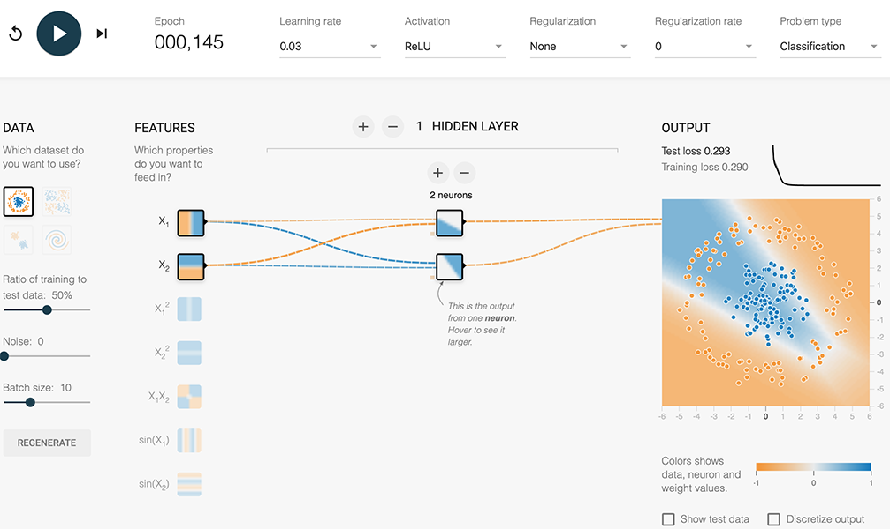
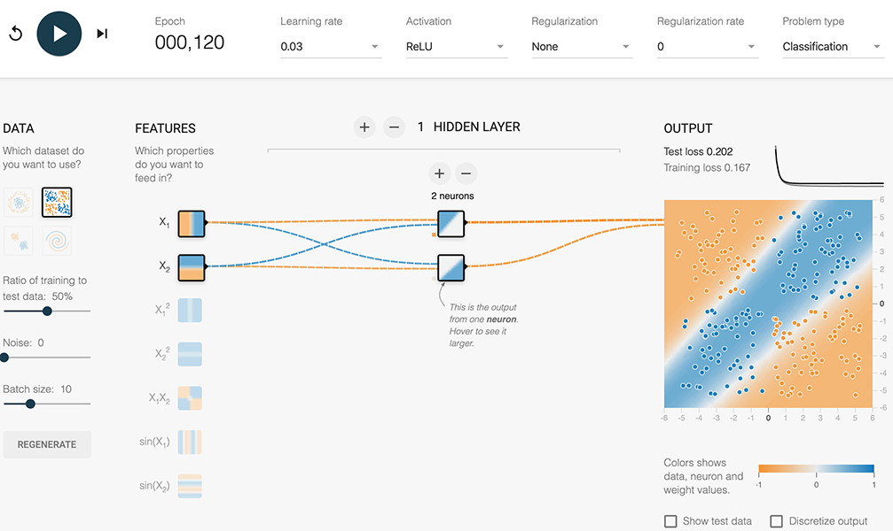
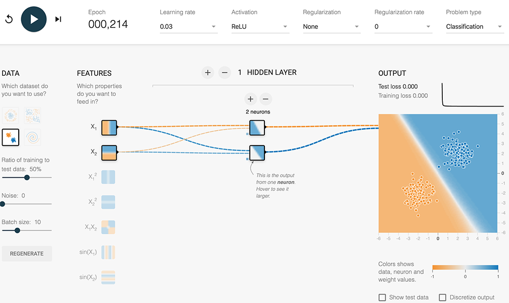
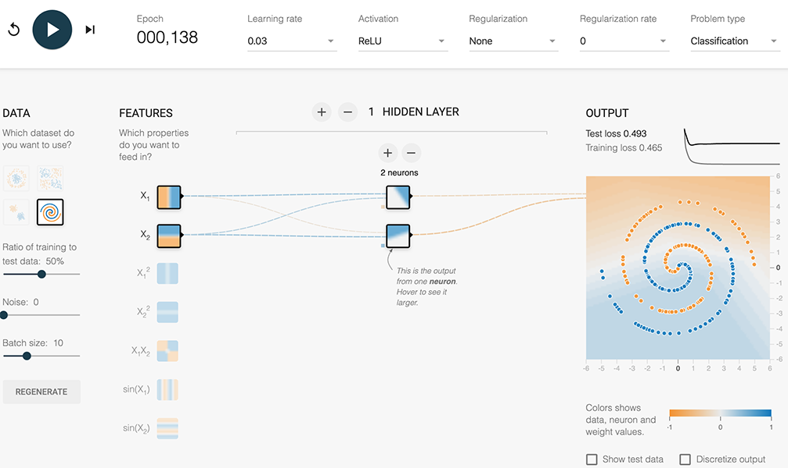

*Task 3: Try increasing the number of neurons in the hidden layer from 2 to 3, using a nonlinear activation like ReLU. Can it model the data effectively? How model quality vary from run to run?*

It’s getting worse at predicting linear distributions, but otherwise it’s better.

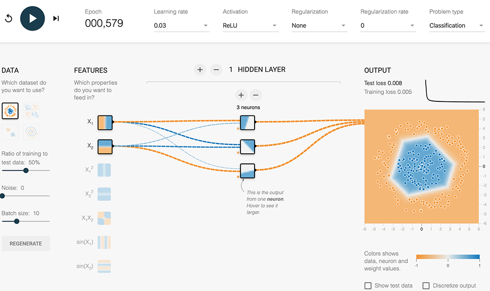
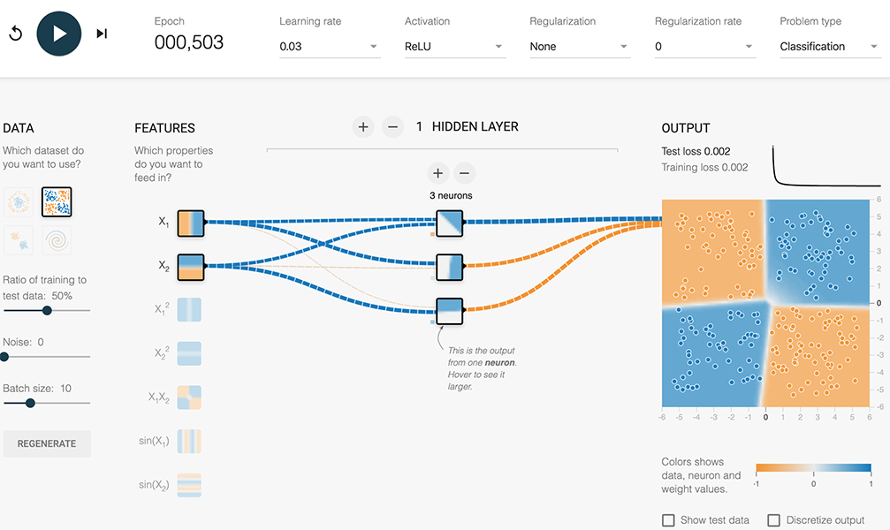
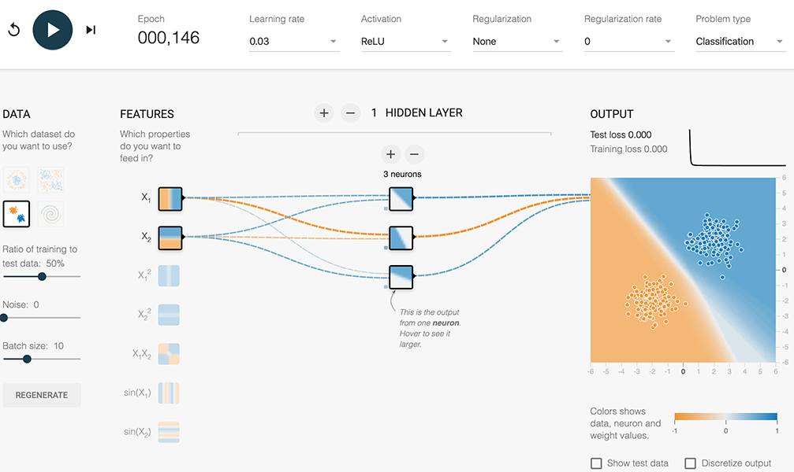
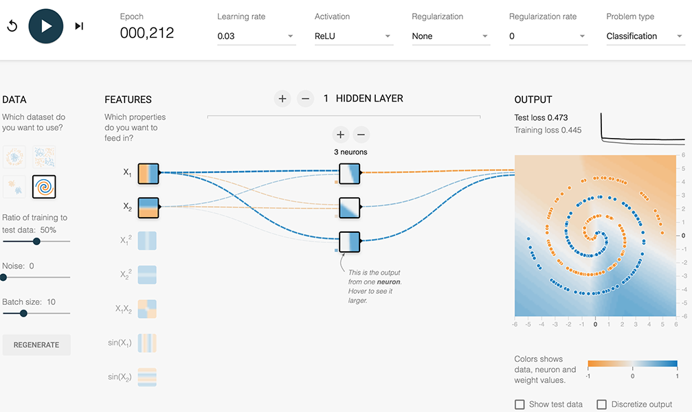

*Task 4: Continue experimenting by adding or removing hidden layers and neurons per layer. Also feel free to change learning rates, regularization, and other learning settings. What is the smallest number of neurons and layers you can use that gives test loss of 0.177 or lower?*

I needed to use at least 2 layers, with a sufficient number of neurons in each that the random weights didn’t cause the neurons to permanently “deactivate”.

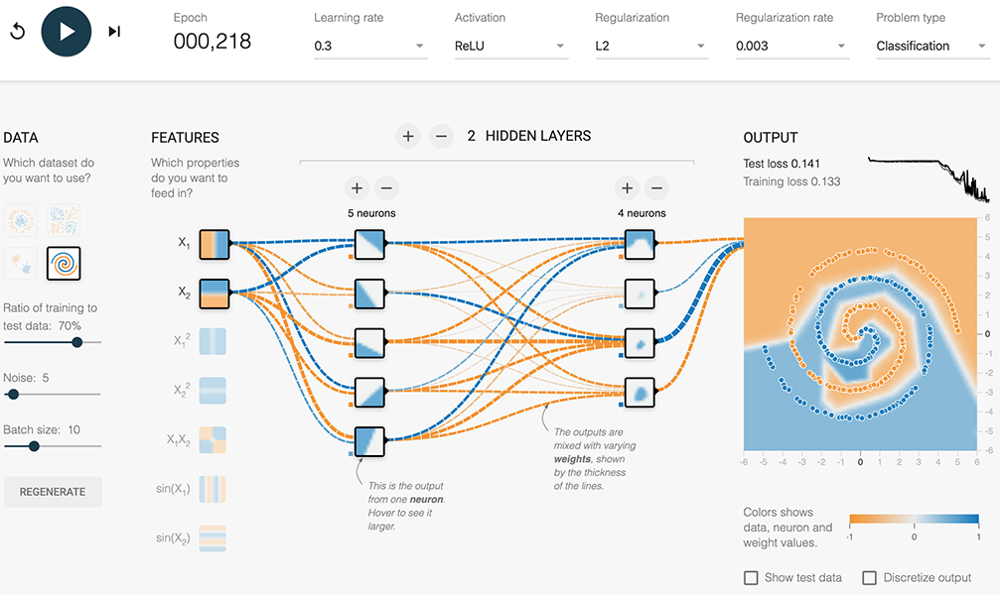

# Lab exercises:

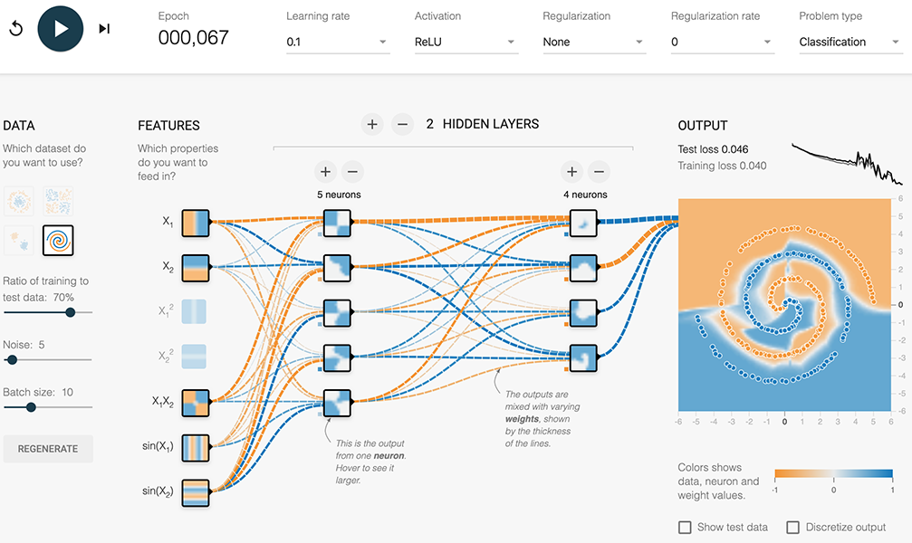
