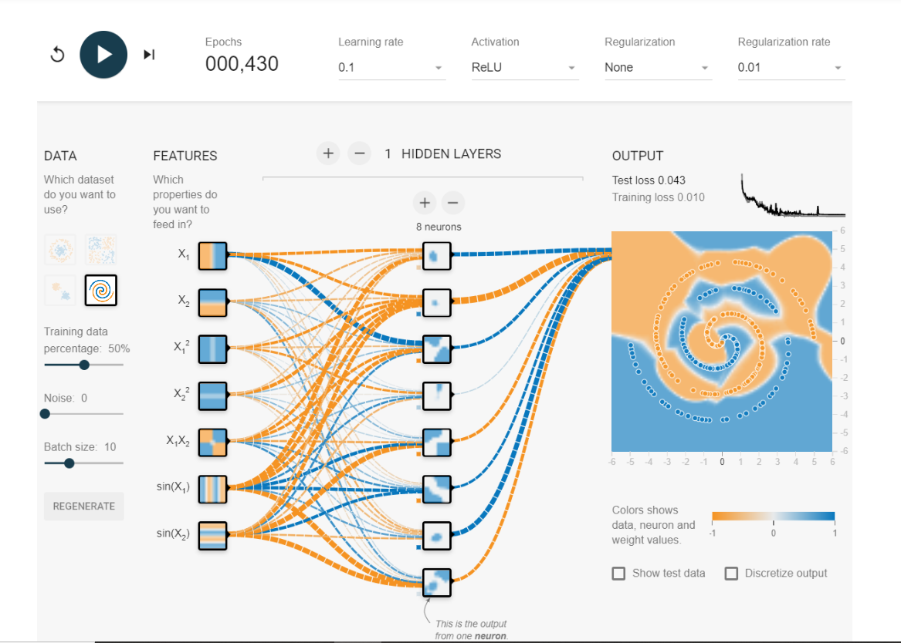
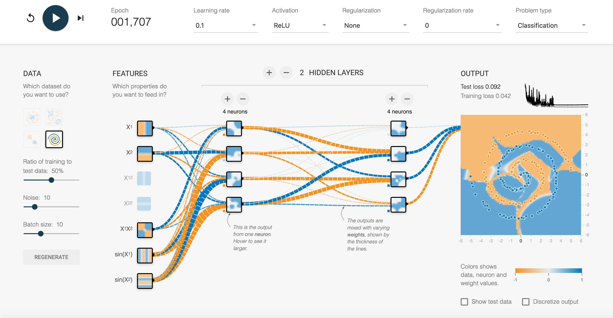

# Challenge 2: Tensorflow Hyperparameter Tuning

## Getting Started

From the lesson and Challenge 1 you should have noticed that understanding the concepts in neural network analysis such as *learning rate*, *epoch*, *optimizer*, *loss function* and so on is essential for you to optimize the neural network models you build. In this challenge you will study several learning pieces that discuss the hyperparameters in Tensorflow. 

**[Neural Networks: Structure](https://developers.google.com/machine-learning/crash-course/introduction-to-neural-networks/anatomy)**

**[Understanding Deep Learning with TensorFlow Playground](https://medium.com/@andrewt3000/understanding-tensorflow-playground-c20cdb7a250b)**

After that, complete [this exercise](https://developers.google.com/machine-learning/crash-course/introduction-to-neural-networks/playground-exercises) on tuning the Tensorflow hyperpamameters in the [Tensorflow Playground](https://playground.tensorflow.org/).

Finally, using what you have learned, try tuning the hyperparameters for the spiral dataset in order to reach training and test loss <0.05 as shown in the following:

After you're done, submit a screenshot of your Playground including the following information:

* Epoch
* Learning rate
* Activation function
* Features included
* Hidden layers and neurons
* Test and training loss

**Do not google for the end solution!**

## Solution:

Task 1: The model as given combines our two input features into a single neuron. Will this model learn any nonlinearities? Run it to confirm your guess.

No, it is set to Linear.

Task 2: Try increasing the number of neurons in the hidden layer from 1 to 2, and also try changing from a Linear activation to a nonlinear activation like ReLU. Can you create a model that can learn nonlinearities? Can it model the data effectively?

Yes to question 1 (it can learn nonlinearities), and no to question 2 (it does not model the data effectivelly)

Task 3: Try increasing the number of neurons in the hidden layer from 2 to 3, using a nonlinear activation like ReLU. Can it model the data effectively? How model quality vary from run to run?

It may model the data, but quality varies from run to run

Task 4: Continue experimenting by adding or removing hidden layers and neurons per layer. Also feel free to change learning rates, regularization, and other learning settings. What is the smallest number of neurons and layers you can use that gives test loss of 0.177 or lower?

Complex model may overfit and perform worse than simpler model.

**TensorFlow Playground**
Test loss <0.05, spiral

